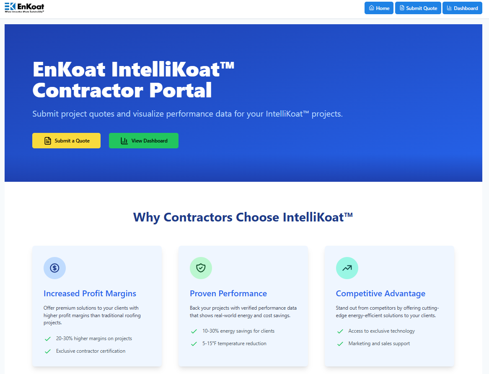
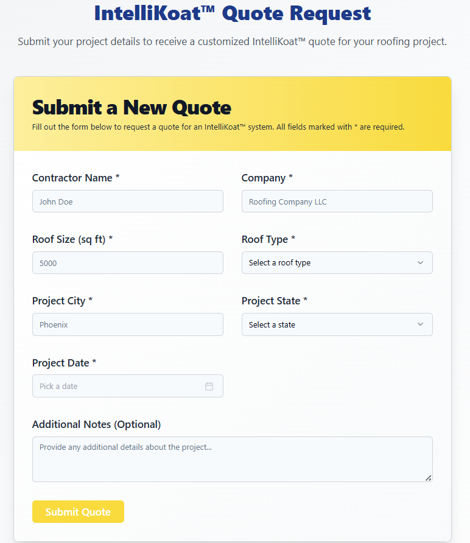

# EnKoat Quote Vision

A full-stack application for EnKoat to manage quotes and visualize project performance data through an intuitive dashboard.



## Overview

EnKoat Quote Vision is a comprehensive contractor portal designed to streamline quote submissions and provide detailed performance analytics for IntelliKoat™ roofing solutions. The application features a modern, responsive interface and robust backend API.

### Quote Submission Interface

Contractors can easily submit project quotes through an intuitive form interface:



### Performance Dashboard

Monitor project performance and analytics through an interactive dashboard:


## Architecture

### Frontend Architecture

The frontend follows a modern React architecture optimized for scalability and maintainability:


### Backend Architecture

The backend follows a layered architecture pattern for clean separation of concerns:


## Project Structure

This project uses a monorepo structure with separate frontend and backend directories:

- `/frontend` - React-based web application built with Vite
  - Modern component architecture
  - Real-time data visualization
  - Responsive design with Tailwind CSS
  - Type-safe development with TypeScript

- `/backend` - Express API server built with Node.js and TypeScript
  - RESTful API endpoints
  - MongoDB database integration
  - TypeScript for type safety
  - Comprehensive error handling

## Features

### Quote Management
- Interactive quote submission form
- Form validation with Zod schemas
- State and roof type selection
- Project details capture

### Project Tracking
- Track project status and progress
- Monitor energy savings metrics
- Cost savings calculations
- Installation date tracking

### Interactive Dashboard
- Real-time performance metrics
- Geographic performance map
- Project statistics visualization
- Interactive charts and graphs
- Filtering by state, roof type, and date
- CSV report export functionality

### Performance Analytics
- Energy efficiency metrics
- Regional performance analysis
- Roof type comparisons
- Trend analysis and reporting

## Quick Start

### Prerequisites

- Node.js (v18+ recommended)
- npm, yarn, or bun package manager
- MongoDB (local installation or cloud instance)

### Setup and Running

1. Clone the repository

2. Set up the backend:
```bash
cd backend
npm install
cp .env.example .env  # Update with your configuration
npm run dev
```

3. In a separate terminal, set up the frontend:
```bash
cd frontend
npm install
cp .env.example .env  # Update with your configuration
npm run dev
```

4. Access the application:
   - Frontend: http://localhost:8080
   - Backend API: http://localhost:5000/api

## Technologies

### Frontend
- React 18 with TypeScript
- Vite for build tooling
- React Router DOM for routing
- TanStack Query for data fetching
- Shadcn/UI Components
- Tailwind CSS with custom theming
- Recharts for data visualization
- React Leaflet for map visualization
- React Hook Form with Zod validation
- Radix UI primitives
- Lucide React icons
- Sonner for toast notifications

### Backend
- Node.js
- Express
- TypeScript
- MongoDB with Mongoose
- Morgan for request logging
- CORS enabled
- Environment configuration with dotenv

### Development
- ESLint for code linting
- TypeScript for type safety
- Prettier for code formatting
- Vite for development server
- Concurrent development servers

## API Documentation

See the [Backend README](./backend/README.md) for detailed API documentation.

## Frontend Documentation

See the [Frontend README](./frontend/README.md) for detailed frontend documentation.

## Environment Variables

### Backend
| Name | Description | Default |
|------|-------------|---------|
| PORT | Port for the API server | 5000 |
| MONGO_URI | MongoDB connection string | mongodb://localhost:27017/enkoat-quote-vision |
| NODE_ENV | Environment (development, production) | development |

### Frontend
| Name | Description | Default |
|------|-------------|---------|
| VITE_API_URL | URL of the backend API | http://localhost:5000/api |

## Contributing

1. Ensure you have all prerequisites installed
2. Follow the setup instructions in Quick Start
3. Create a feature branch
4. Make your changes
5. Submit a pull request

## License

Copyright © 2025 EnKoat. All rights reserved.
